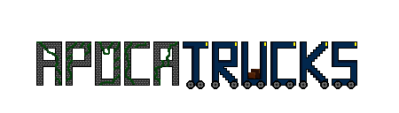

# Ludum Dare 53

This game was created over a weekend as part of [Ludum Dare 53](https://ldjam.com/events/ludum-dare/53), the theme was **Delivery**.

- [Ludum Dare Game Page](https://ldjam.com/events/ludum-dare/53/$337692/)

---

## Description

Welcome to APOCATRUCKS a thrilling tower defense game set in a post-apocalyptic world. In this game, the world as we know it has been destroyed, and you must protect your bunkers and towns from waves of bio enhanced raiders and mutated creatures by strategically delivering supplies to towers and supplying your troops with ammo and food.

As you progress through the game's onslaught, you'll face increasingly difficult challenges. You'll need to protect your base from raiders who want to steal your towns, and mutated creatures who have become hostile due to the catastrophic event. You'll need to manage your trucks carefully, balancing the need for ammunition and food to ensure your troops are well-fed and well-equipped.

In this game, the choices you make can have a significant impact on the outcome of your playthrough. You'll need to decide where to send your trucks to your towers and which towers to deliver your supplies to which will defend your towns.

---

## Technologies

- Game Engine - [Godot](https://godotengine.org/)
- Pixal Art - [Aseprite](https://www.aseprite.org/)
- Music & Sound Effects - [Bosca Ceoil](https://boscaceoil.net/)

---

## Contributors

### Anna Lykkeberg (_Artwork_)

### David Thomson (_Programming_) - [Github](https://github.com/iamdavidmt)

### Keri Knier (_Programming_) - [GitHub](https://github.com/iamdavidmt)

### Lewis McNeill (_Programming_) - [GitHub](https://github.com/lewis785)

### Nicholas Robinson (_Programming, Music_) - [GitHub](https://github.com/nkrobinson)
